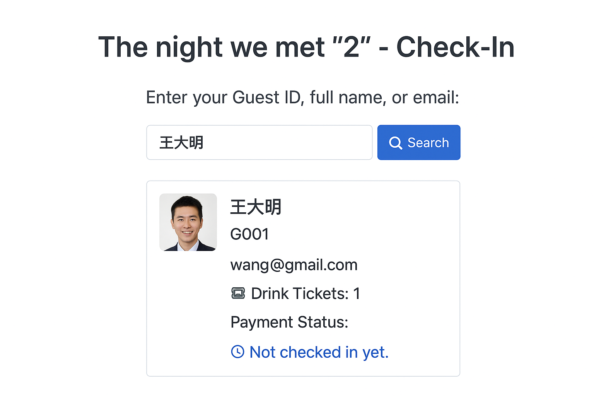

# 🎉 Guest Check-In System (Google Apps Script + Sheets)

This is a lightweight self check-in system for events using **Google Apps Script**, **Google Sheets**, and a **mobile-friendly frontend**. Guests can enter their **Guest ID**, **full name**, or **email** to check in, see their assigned drink tickets, payment status, and whether they’ve already checked in.

---

## ✨ Features

- ✅ Search by Guest ID, Name (partial), or Email
- ✅ Prevents duplicate check-ins
- ✅ Displays:
  - Drink tickets
  - Payment status
  - Check-in time
- ✅ Marks attendance in Google Sheets
- ✅ Works great on mobile phones
- ✅ Friendly UI with optional guest image
- ✅ No external libraries or backend required

---

## 📁 Files

| File         | Description |
|--------------|-------------|
| `index.html` | Frontend form for guest lookup and check-in |
| `Code.gs`    | Google Apps Script backend to handle lookup and check-in |
| `README.md`  | This file |

---

## 📋 Setup Instructions

### 1. **Prepare Your Google Sheet**

Create a Google Sheet with a tab named `Guests` and the following headers:

Guest ID | Name | Email | Drink Tickets | Payment Status | Checked In | Check-in Time

> Note: `Checked In` is a boolean (`TRUE/FALSE`), and `Check-in Time` is left empty initially.

> example: https://docs.google.com/spreadsheets/d/1xM2FEM6wCVwmeNHdaP_OuKCAn43TVb375r0bosGjmCk/edit?gid=0#gid=0

---

### 2. **Deploy the Web App**

1. Go to [Google Apps Script](https://script.google.com/)
2. Create a new project and add:
   - `Code.gs` for backend
   - `index.html` for frontend (under “Files → New → HTML”)
3. Replace `"SPREADSHEET_ID"` in `Code.gs` with your sheet’s actual ID (from the URL)
4. Deploy:
   - Click `Deploy > Manage deployments`
   - Select **"Web App"**
   - Set "Execute as" → **Me**
   - Set "Who has access" → **Anyone (or Anyone with the link)**
   - Click **Deploy**

---

### 3. **Share the Check-In Page**

Send guests the link to the deployed web app, or display a QR code at the venue.

---

## 🧪 Debugging Tips

- Use `console.log()` in `index.html` to inspect input and result objects.
- Use `Logger.log()` in `Code.gs` and view logs via `View → Logs`.
- Add `.normalize().trim().toLowerCase()` to prevent search issues with Unicode or extra spaces.
- Dates must be converted to strings before returning from server.

---

## 📱 Mobile UI

- Enlarged fonts and input fields
- Full-width buttons
- Optional guest image (use logo or avatar)
- Works smoothly on all screen sizes

---

## 🛠️ Future Improvements

- [ ] QR code check-in via camera
- [ ] Admin dashboard for live guest stats
- [ ] Integration with Google Forms for RSVP
- [ ] Auto-email guests their Guest ID

---

## 📄 License

MIT License

---

## 💡 Author

Built by [You-Yi] for event guest management.

